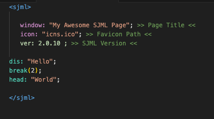
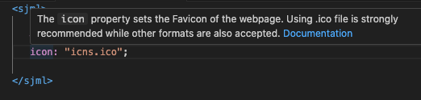
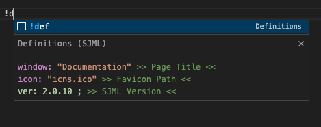

# SJML

The official support extension  for the SJML programming languages

## Features

### Syntax Highlighting
 
Provides fully functional syntax highlighting support for SJML files, making it easier to understand, read and write code.

### References and Documentation
 
This extension provide information and references about specific keywords, functions and methods of SJMl. The extension also provide the documentation link for the each keyword, making it easier to understand and learn SJML!

### Code Snippets
 
This extensions also offers a lot of code snippets for SJML to make coding faster and to boost productivity.

## Known Issues

- Sometimes it might highlight the rest of the code until a certain keyword completely typed. (This could also be a missing semicolon)

> [!TIP] 
> You can help us improve this by [reporting](https://hirujaedurapola.github.io/sjml/bug) bug and issues.

## Release Notes

### 1.0.0

- Initial release of SJML

### 1.1.0

- Added Coding Snippets

### 1.2.0

- Added more snippets

### 1.3.0

- Added more snippets
- Added syntax highlighting features

### 1.4.0

- Fixed bug: file icons disappearing while a sjml file is open.
- Added more syntax highting support

### 2.0.0 

- Stable Release
- Minor Bug Fixes
- Added Reference Support
- Improved syntax highlighting
- Added a basic template to snippets

### 2.0.1

- Minor Bug Fixes

### 3.0.0

- Minor Bug Fixes
- Added Auto Completion
- Added Error Checking Features
- Fixed Bug `!def` doesn't generate semi-colons
---

## Contributions

**If you like to contribute for both the Extension and the Language please visit our contributions page at [https://hirujaedurapola.github.io/SJML/contribute](https://hirujaedurapola.github.io/SJML/contribute)**

#### Made By [Hiruja Edurapola](https://hirujaedurapola.github.io/)

